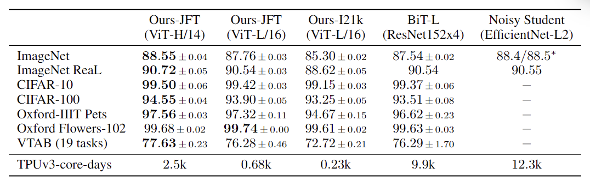
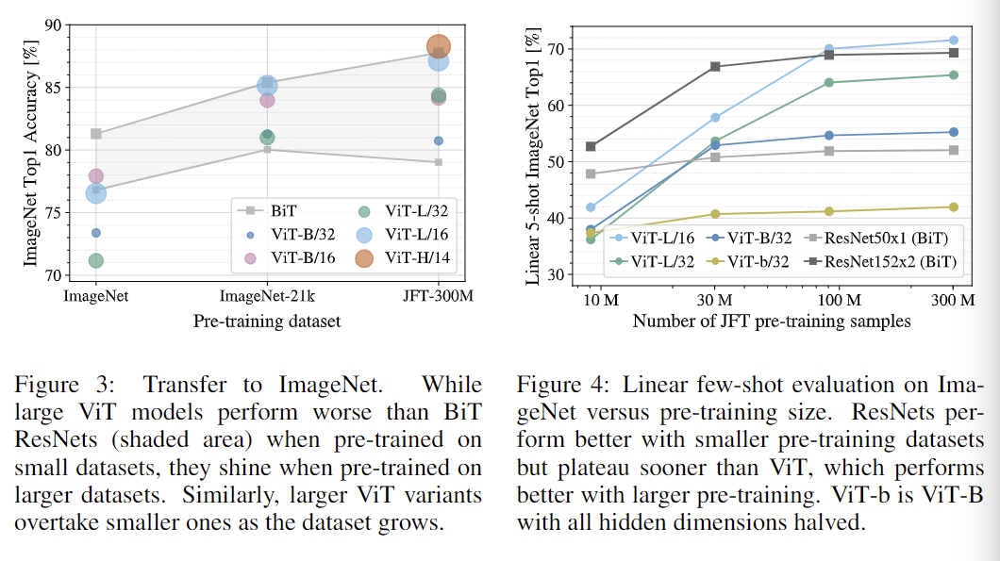
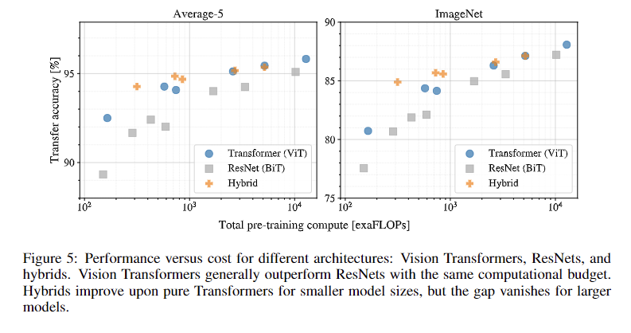
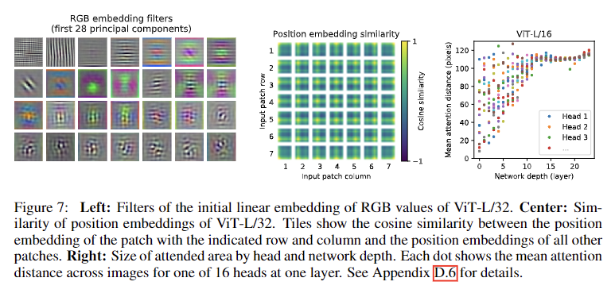
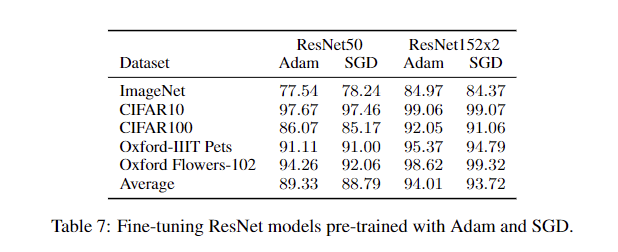
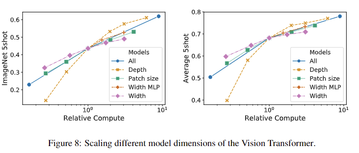
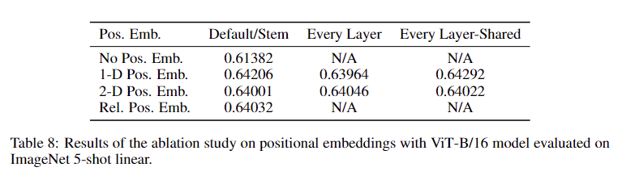
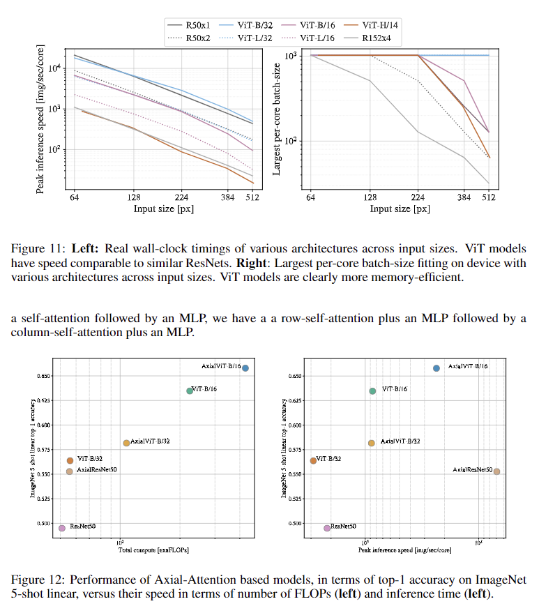
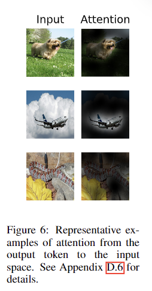

# Introduction
This repository is for the group course work of COMP6248.

# Plan
The aim is to reproduce the code of the paper [An Image is Worth 16x16 Words: Transformers for Image Recognition at Scale](https://openreview.net/forum?id=YicbFdNTTy).

First meeting: 10-April. The paper should have been read before the meeting.

Notice that the hand-in deadline is 13-May-2022 16:00.

## Experiments

Here are most of the experiments in the paper. We will reproduce some experiments with check marks.
* Build a standard ViT. √ 
* Pretrained ViT on JFT and finetune on other datasets comparing with other models like ResNet.

* Pretraining on different size of datasets of ImageNet, ImageNet-21k, and JFT-
300M.
* Training on random subsets of 9M, 30M, and 90M as well as the full JFT-
300M dataset.

* Transfer accuracy with increasing pre-training compute.

* Research into embedding filters.
* Research into positional embedding.
* Research into attention distance.

* The performance of ViT with self-supervision.
* Compare SGD and Adam on ResNet.

* Test different Transformer shapes.

* Compare positional embeddings of 1-D, 2-D and relative one.

* More research on axial attentions.

* Attention maps.

## Information of datasets used in paper

| dataset              | size       | number of images | number of classes |
|----------------------|------------|-----------------:|------------------:|
| JFT-300M             | Unreleased |      303,000,000 |            18,291 |
| ImageNet 21k         | Unknown    |       14,197,122 |            21,841 |
| ImageNet ILSVRC-2012 | 155GB      |        1,281,167 |             1,000 |
| ImageNet ReaL (val)  | 6GB        |           50,000 |             1,000 |
| CIFAR-10             | 170MB      |           60,000 |                10 |
| CIFAR-100            | 170MB      |           60,000 |               100 |
| Oxford Flowers       | 330MB      |            8,189 |               102 |
| Oxford IIIT-Pets     | 775MB      |            7,394 |                37 |