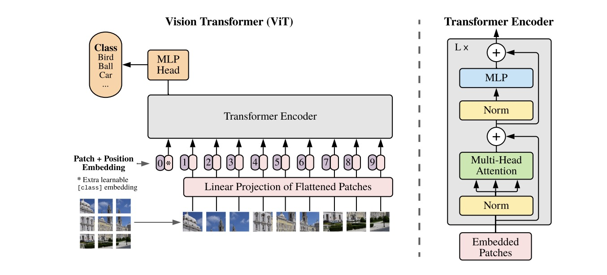
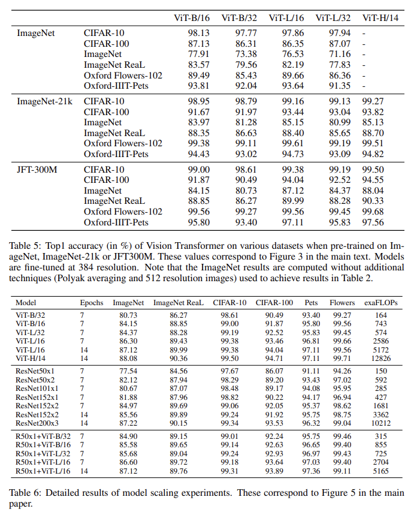

# Introduction

This repository reproduced the Pytorch code of the
paper [An Image is Worth 16x16 Words: Transformers for Image Recognition at Scale](https://openreview.net/forum?id=YicbFdNTTy)
and some experiments of it.

This repository is for the group course work of COMP6248.

# How to use

## Requirements:

> Python >= 3.7.2
>
> pytorch >= 1.11
>
> torchvision >= 0.12.0
>
> matplotlib >= 3.3
>
> scipy >= 1.6

Conda virtual environment command example:

```
conda create -n [your_venv_name] python=3.7.2
conda activate [your_venv_name]
conda install pytorch==1.11 torchvision torchaudio cudatoolkit=11.3 -c pytorch
conda install matplotlib scipy
```

## Instantiate a Vision Transformer model

Following shows how to instantiate a model:

```python
from models import ViT

model = ViT(input_size=(224, 224),
            patch_size=(16, 16),
            num_classes=1000)  # ViT-B/16
```

## Load pre-trained model

Following shows how to load a pre-trained model:

```python
from models import ViTB16

model = ViTB16(pretrained=True)  # pre-trained ViT-B/16
```

The `ViTB16` will download the pre-trained model that provided by [torchvision](https://github.com/pytorch/vision) and
automatically transfer it to our form of state dictionary.

# Plan

The aim is to reproduce the code of the
paper [An Image is Worth 16x16 Words: Transformers for Image Recognition at Scale](https://openreview.net/forum?id=YicbFdNTTy)
.

* First meeting: 10-April. The paper should have been read before the meeting.

* Second meeting: 21-April. Try to transfer pretrained model and fine-tune on other datasets.

* Third meeting: 30-April. Finish experiments.

* Fourth meeting: TBD. Report writing.

Notice that the hand-in deadline is **13-May-2022 16:00**.

## Experiments

### Information of datasets used in paper

| dataset              | size       | number of images | number of classes | Resolution   |
|----------------------|------------|-----------------:|------------------:|--------------|
| JFT-300M             | Unreleased |      303,000,000 |            18,291 | Unknown      |
| ImageNet 21k         | Unknown    |       14,197,122 |            21,841 | 469*387(avg) |
| ImageNet ILSVRC-2012 | 155GB      |        1,281,167 |             1,000 | 469*387(avg) |
| ImageNet ReaL (val)  | 6GB        |           50,000 |             1,000 | 469*387(avg) |
| CIFAR-10             | 170MB      |           60,000 |                10 | 32*32        |
| CIFAR-100            | 170MB      |           60,000 |               100 | 32*32        |
| Oxford Flowers-102   | 330MB      |            8,189 |               102 | around 500   |
| Oxford IIIT-Pets     | 775MB      |            7,394 |                37 | around 500   |

### Reproduced experiments

Here are most of the experiments in the paper. We will reproduce some of them with check marks.

"<font color=lime>√</font>" indicates that the reproduced experiment is included in this repository.

"<font color=red>×</font>" indicates that the reproduced experiment is NOT included in this repository.

* Build a standard ViT. <font color=lime>√</font>
  
* Pretrained ViT on JFT and finetune on other datasets comparing with other models like ResNet. <font color=red>×</font>
  
* Pretraining on different size of datasets of ImageNet, ImageNet-21k, and JFT- 300M. <font color=red>×</font>
* Training on random subsets of 9M, 30M, and 90M as well as the full JFT- 300M dataset. <font color=red>×</font>
  
* Transfer accuracy with increasing pre-training compute. <font color=red>×</font>
  
* Research into embedding filters. <font color=lime>√</font>
* Research into positional embedding. <font color=lime>√</font>
* Research into attention distance. <font color=lime>√</font>
  
* The performance of ViT with self-supervision. <font color=red>×</font>
* Transfer pre-trained models to various datasets. <font color=lime>√</font>
* 
* Compare SGD and Adam on ResNet. <font color=red>×</font>
  
* Test different Transformer shapes. <font color=red>×</font>
  
* Compare positional embeddings of 1-D, 2-D and relative one. <font color=red>×</font>
  
* More research on axial attentions. <font color=red>×</font>
  
* Attention maps. <font color=lime>√</font>
  

